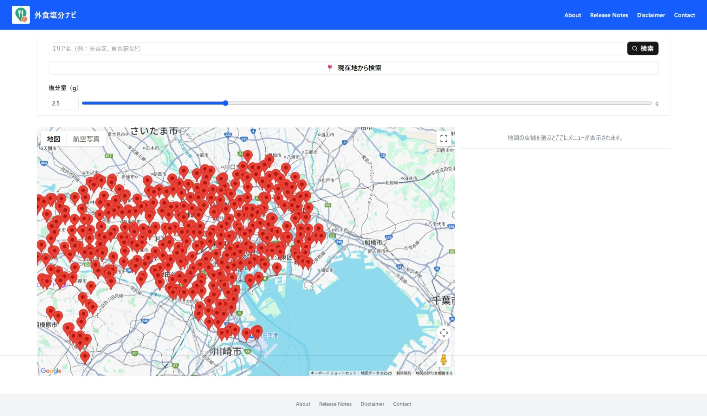
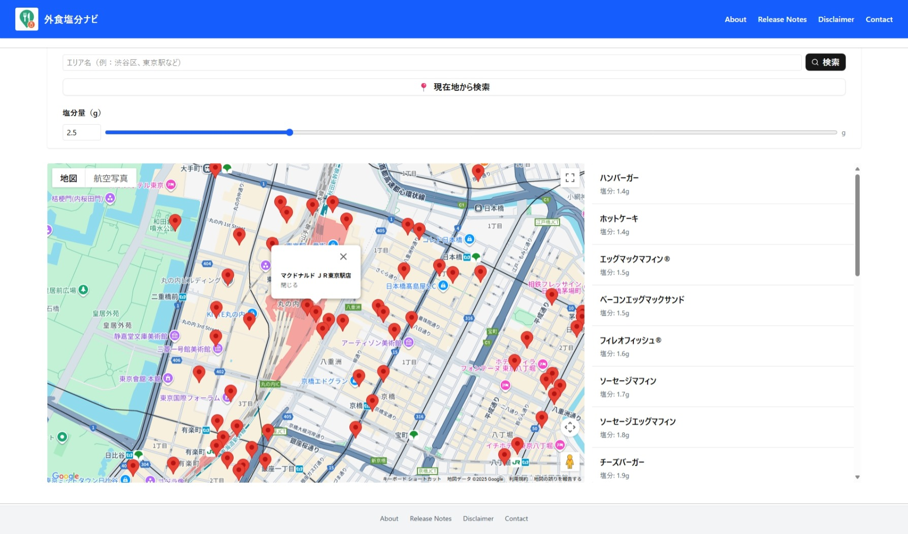

# 外食塩分ナビ

## 塩分量でフィルタできる外食検索アプリ

外食チェーンのメニューを塩分量で絞り込んで検索できる Web アプリです。

塩分制限が必要な方や健康志向の方が、外食時でも自分に合ったメニュー・店舗を簡単に見つけられるようサポートします。

## 開発背景

腎臓病や高血圧など、減塩制限が必要な方にとって外食の塩分量は大きな悩みです。

しかし、レストランやファストフードなどの栄養情報は各社ごとにバラバラに公開されており、探すのが困難です。

「外食したいけど、どのメニューが安心なのか分からない」「塩分量を比較したいけど情報がまとまっていない」そんな声に応えるため、外食時にも安心して食事を選べる『塩分量で絞り込みできる検索アプリ』を開発しました。

## 主な機能

### エリア検索

指定した住所やランドマークから近隣の店舗を検索できます。

### 現在地検索

ユーザーの現在地情報を取得し、近くの店舗を検索できます。

### 塩分量でのフィルタリングした Google マップ表示

設定した塩分上限値でメニューを絞り込み、該当メニューがある店舗を地図上にマーカー表示します。

### クリックした店舗のメニュー表示

マーカーをクリックすると、その店舗のメニュー情報（塩分量含む）を表示します。

## ご利用上の注意

- メニュー情報は AI による自動読み取り＋人力チェックですが、誤りが含まれる可能性があります
- 店名・栄養成分表示などで最終的な確認をお願いします
- 現在は東京都の店舗のみ表示しています
- 登録店舗は一部チェーンのみです

## 今後の予定

- 全国エリア対応
- 店舗の追加
- 値段の表示
- メニュー名からの横断検索（例：「オムライス」と入力すると、複数チェーンの該当メニューと塩分量を一覧表示）

## 技術スタック

| カテゴリ       | 技術・サービス                                 |
| -------------- | ---------------------------------------------- |
| フロントエンド | Next.js / React / TypeScript / Tailwind CSS    |
| バックエンド   | Next.js API Routes / Prisma / Supabase（予定） |
| データベース   | SQLite（開発用） / Supabase（本番予定）        |
| CI/CD          | GitHub Actions                                 |
| 開発支援       | GitHub Copilot / ESLint / Prettier             |
